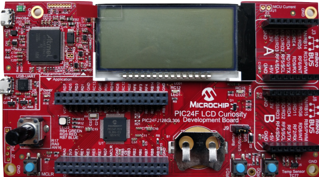

 

# PIC24F LCD Curiosity Development Board Out-of-Box Demo

## Summary

This is the demo software which runs on PIC24F LCD Curiosity Development Board(DM240017). The PIC24F LCD Curiosity Development Board is a cost-effective, fully integrated development platform targeted at first-time users, Makers, and those seeking a feature-rich rapid prototyping board. Refer to https://www.microchip.com/pic24flcdcuriosity for additional details about the board.

## Related Documentation

- PIC24F GU/GL Low Power MCUs: https://www.microchip.com/PIC24F-GU-GL
- PIC24FJ128GL306 microcontroller https://www.microchip.com/PIC24FJ128GL306

## Hardware Used 

- PIC24F LCD Curiosity Development Board (https://www.microchip.com/DM240017) 

## Software Used 

- MPLAB® X IDE v5.35 or newer (https://www.microchip.com/mplabx)
- MPLAB® XC16 v1.50 or newer (https://www.microchip.com/xc)
- MPLAB® Code Configurator(MCC) v3.95 (https://www.microchip.com/mplab/mplab-code-configurator)

## Operation

This example has two main modes of operation 
1. USB powered mode
2. Battery powered mode.

## USB Powered Mode

In USB powered mode, there are four different display modes. Pressing the **S2** button will switch between each of the display modes. To run in USB powered mode, set the jumper J9 position to 1 and 2.

In alternate LCD display just toggles between the text "PIC24" and "LCD". This toggling is done automatically by the LCD module using the alternate display mode of the module. LCD module setup with the "PIC24" text in the main display memory and the "LCD" text in the alternate display memory. LCD automatically toggles between the two texts.

In potentiometer display mode, the 12-bit value of the potentiometer will be displayed, to see the change of potentiometer value on the LCD screen in this mode change the on-board potentiometer value by rotating the knob.  The value ranges from 0 - 4095 to be displayed on the LCD in this display mode.    

In build time display mode, build time of the build_time.c file is displayed on the LCD. Note that this is the build time of the build_time.c file. If you do not clean/build the project, then the time will not update from the last time that file was built.

In the temperature display mode, the current temperature is displayed on the LCD is measured from the TC77 temperature Sensor available on this board. The temperature toggles between Celsius and Fahrenheit using the LCD alternate display mode. The values are set just once for both and the LCD automatically toggles between the two.

The potentiometer will change the intensity of the RGB LED channel that is currently active.  Switch S1 will change which of the three colors is currently active (red, green, or blue).

A COM port can be opened to view the data through the USB->UART bridge.  All the above data is displayed on the screen (time, temperature, potentiometer,
etc.).  The serial port needs to be set to 9600 baud, 8 bit, no parity, 1 stop, no flow control.

## Battery Powered Mode

If the USB power is disconnected, then the board can run from a battery backup and will go into battery powered mode. To run board in the battery powered mode a CR2032 battery should be inserted into the B1 battery socket which is on board. Set the J9 jumper position to 2 and 3.

In battery powered mode the battery status icon indicates the current battery status.

The time will be displayed on the screen in this mode. The ":" blinks using the LCD modules blink feature. The CPU does not need to wake up to update the screen for the ":".

The CPU wakes up once a minute in this mode to update the time on the screen. LED LED1 will blink while the CPU is awake. The CPU will also wake up when the USB power is detected.

All the other functionality from the USB mode is disabled.

To measure the power consumption of the board, a meter can be placed between the pins 2 and 3 of jumper J9 (that goes to the battery housing.  To measure the current of the CPU, cut the trace on the bottom of the board under jumper J1 and place a meter between the two pins. 

